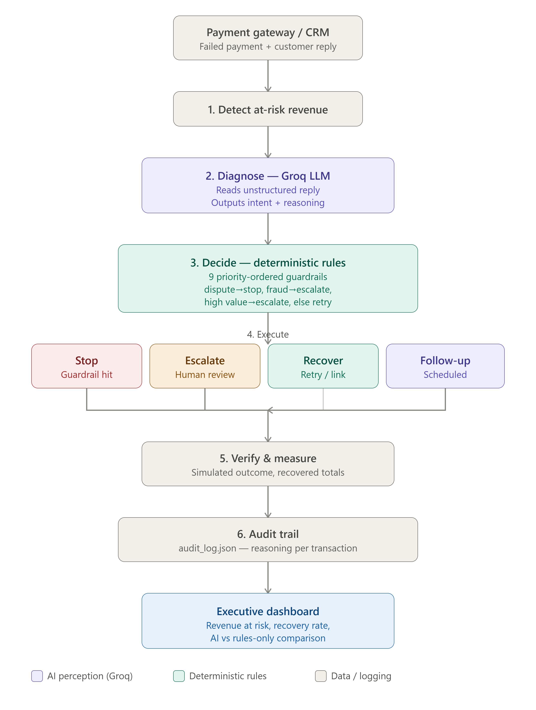

# RecoverX — AI Revenue Recovery Agent

RecoverX is a safety-first revenue recovery MVP built for the Razorpay AI Revenue Recovery track. It uses an LLM to interpret customer context, then routes that context through deterministic policy guardrails before any recovery action is selected.

> **Important:** payment outcomes and recovered amounts in this repository are simulated for the MVP benchmark. RecoverX does not move real money.

## Why RecoverX

Traditional recovery systems often retry failed payments without considering what the customer is saying. RecoverX adds customer context while keeping financial action deterministic and auditable.

```text
Customer reply
      ↓
AI / safety-first intent interpretation
      ↓
Deterministic policy guardrails
      ↓
RETRY · PAYMENT LINK · REMINDER · FOLLOW-UP · ESCALATE · STOP
      ↓
Deterministic simulated outcome
      ↓
Audit trail
```

The LLM does **not** execute financial actions directly.

## Core guardrails

| Signal | Policy action |
|---|---|
| Dispute / already-paid claim | STOP |
| Fraud / unauthorized-use claim | ESCALATE |
| Retry limit reached | STOP |
| High-value transaction | ESCALATE |
| Promise to pay later | FOLLOW-UP |
| Temporary network error | RETRY |
| Expired card | PAYMENT LINK |

## Current benchmark

The bundled synthetic dataset contains **47 transactions** with **₹6,52,305** total value at risk.

A representative controlled run produced:

| Metric | AI-assisted | Rules-only |
|---|---:|---:|
| Recovered | ₹1,16,363 | ₹1,16,363 |
| Automated recovery attempted | ₹2,38,316 | ₹2,72,267 |
| Attempt success rate | 48.8% | 42.7% |
| Follow-up value | ₹59,558 | ₹0 |

The benchmark therefore demonstrates **recovery parity with lower automated exposure and better successful-attempt efficiency**, rather than claiming unsupported additional recovered revenue.

## Product highlights

- Customer-context intent classification with persistent caching for reproducible demos.
- Deterministic policy engine that keeps hard financial guardrails authoritative.
- Deterministic paired outcome simulation so the same transaction gets the same underlying outcome score across AI and rules runs.
- Recovery queue for promise-to-pay cases.
- Transaction-level decision explanation and audit trail.
- CSV audit export.
- Automated safety tests.

## Architecture



## Run locally

```powershell
python -m venv venv
venv\Scripts\activate
pip install -r requirements.txt
```

Create `.env` in the project root:

```text
GROQ_API_KEY=your_api_key_here
```

Then:

```powershell
python app.py
```

Open `http://127.0.0.1:5000`.

## Tests

```powershell
python -m unittest discover -s tests -v
```

The submission safety suite covers dispute hard-stop, fraud escalation, promise-to-pay follow-up, retry limits, follow-up accounting, and deterministic simulation.

## Demo flow

1. Run with AI ON.
2. Show the impact panel and follow-up queue.
3. Open a promise-to-pay case and show intent → policy → follow-up.
4. Open a dispute case and show the hard STOP guardrail.
5. Toggle AI OFF and compare the same batch.
6. Export the audit trail.

## Tech stack

- Python 3.11+
- Flask
- Groq API (`openai/gpt-oss-20b`)
- Vanilla JavaScript + Chart.js
- CSV / JSON / JSONL audit data

## Security notes

- Keep `.env` out of Git.
- Runtime cache and audit-history files are ignored by Git.
- Use a production WSGI server and disable Flask debug mode outside local demos.

## License

MIT
